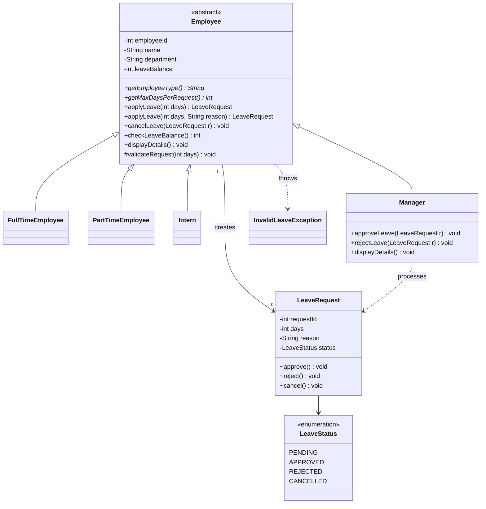

# Class Diagram

```mermaid
classDiagram
    class Employee {
        <<abstract>>
        -int employeeId
        -String name
        -String department
        -int leaveBalance
        +getEmployeeType() String*
        +getMaxDaysPerRequest() int*
        +applyLeave(int days) LeaveRequest
        +applyLeave(int days, String reason) LeaveRequest
        +cancelLeave(LeaveRequest r) void
        +checkLeaveBalance() int
        +displayDetails() void
        #validateRequest(int days) void
    }
    class FullTimeEmployee
    class PartTimeEmployee
    class Intern
    class Manager {
        +approveLeave(LeaveRequest r) void
        +rejectLeave(LeaveRequest r) void
        +displayDetails() void
    }
    class LeaveRequest {
        -int requestId
        -int days
        -String reason
        -LeaveStatus status
        ~approve() void
        ~reject() void
        ~cancel() void
    }
    class LeaveStatus {
        <<enumeration>>
        PENDING
        APPROVED
        REJECTED
        CANCELLED
    }
    class InvalidLeaveException
    Employee <|-- FullTimeEmployee
    Employee <|-- PartTimeEmployee
    Employee <|-- Intern
    Employee <|-- Manager
    Employee "1" --> "0..*" LeaveRequest : creates
    LeaveRequest --> LeaveStatus
    Manager ..> LeaveRequest : processes
    Employee ..> InvalidLeaveException : throws
```
